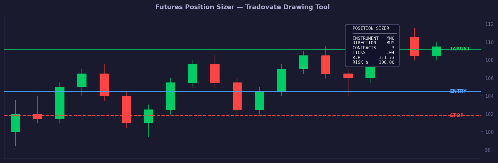

# Futures Position Sizer

A custom drawing tool for **Tradovate** that calculates optimal position size for futures trading based on account risk management rules.

## What it does

Place 3 (or 4) anchors on the chart and the tool instantly calculates:

- **Contracts** — how many contracts to trade based on your risk settings
- **Direction** — BUY or SELL detected automatically from stop placement
- **Ticks** — stop distance in ticks
- **Risk/Contract** — dollar risk per contract
- **Risk Total** — total dollar risk for the trade
- **R:R Ratio** — risk/reward ratio (when target anchor is placed)

All values update in real time as you move the anchors.

## Anchors

| # | Anchor | Color | Description |
|---|--------|-------|-------------|
| 1 | Entry | Blue | Your entry price level |
| 2 | Stop | Red | Your stop-loss level |
| 3 | Panel | Gray | Info panel position (drag anywhere) |
| 4 | Target | Green | Target price for R:R calculation (optional) |

**BUY setup** — stop below entry  
**SELL setup** — stop above entry

## Supported Instruments

| # | Symbol | Full Name | Tick Size | Tick Value |
|---|--------|-----------|-----------|------------|
| 1 | MNQ | Micro E-mini Nasdaq-100 | 0.25 | $0.50 |
| 2 | MGC | Micro Gold | 0.10 | $1.00 |
| 3 | MES | Micro E-mini S&P 500 | 0.25 | $1.25 |
| 4 | M2K | Micro E-mini Russell 2000 | 0.10 | $0.50 |
| 5 | MCL | Micro Crude Oil | 0.01 | $1.00 |
| 6 | NQ | E-mini Nasdaq-100 | 0.25 | $5.00 |
| 7 | ES | E-mini S&P 500 | 0.25 | $12.50 |
| 8 | GC | Gold | 0.10 | $10.00 |

## Parameters

| Parameter | Description | Default |
|-----------|-------------|---------|
| `instrument` | Instrument number (1–8) | 1 (MNQ) |
| `accountCapital` | Account size in USD | $10,000 |
| `riskPercent` | Risk per trade in % | 1.0% |

## Installation

1. Open Tradovate
2. Open the **Code Editor**
3. Create a new file or import `FuturesPositionSizer.js`
4. Save — the tool appears under **Drawing Tools → My Tools**

## R:R Color Coding

| Color | Condition |
|-------|-----------|
| 🟢 Green | R:R ≥ 2.0 |
| 🟡 Yellow | R:R ≥ 1.0 |
| 🔴 Red | R:R < 1.0 |
